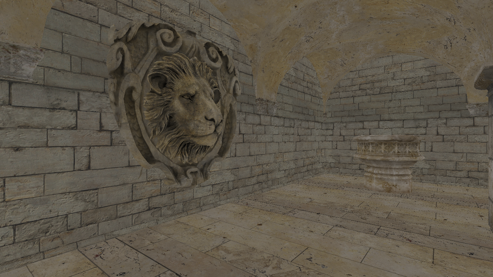
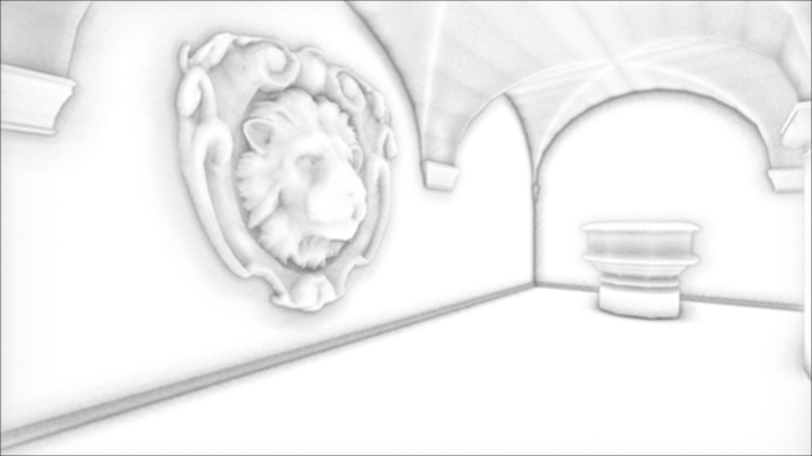
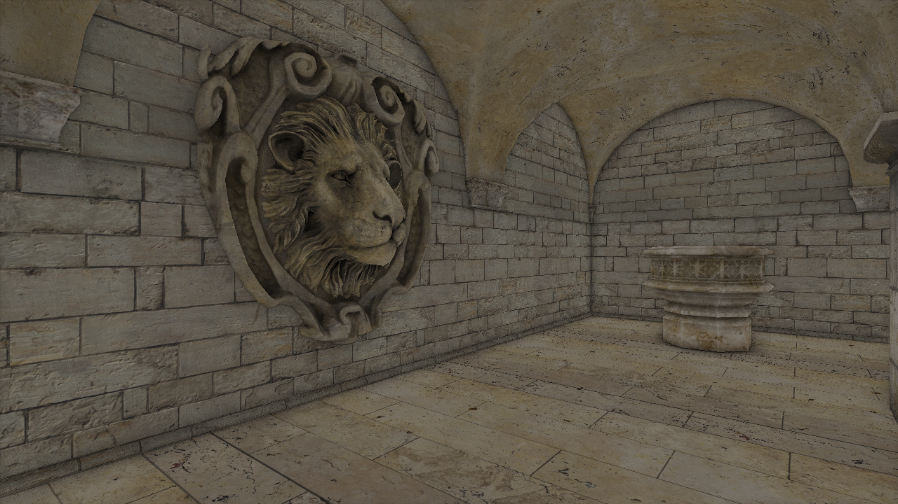
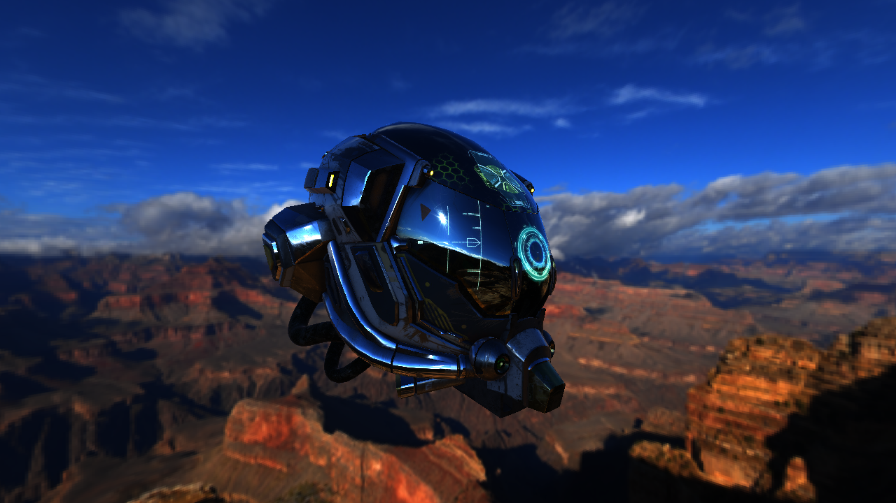

# DXSamples
一个基于Direct3D 12的Model Viewer。
* 支持Gltf 2.0模型。
* 支持SSAO算法。
## Gltf
使用tinygltf进行模型加载，使用MikkTSpace计算切线。  
<https://github.com/syoyo/tinygltf>  
<https://github.com/mmikk/MikkTSpace>
## SSAO
### 原图

### SSAO  

### 模糊  

### Final  

## PBR

